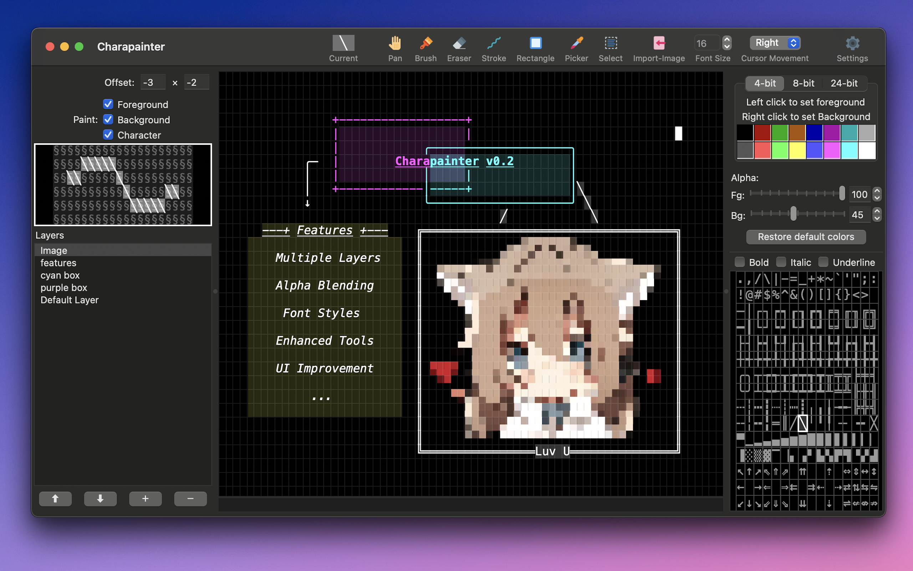
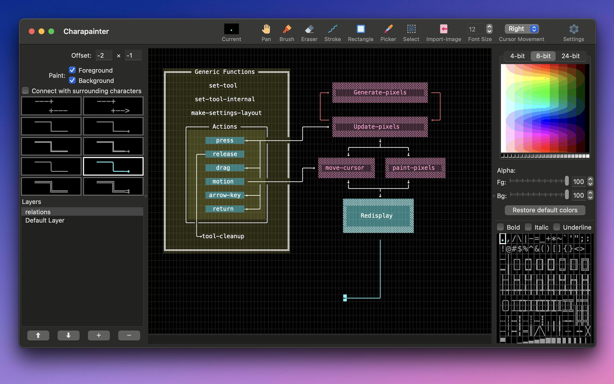
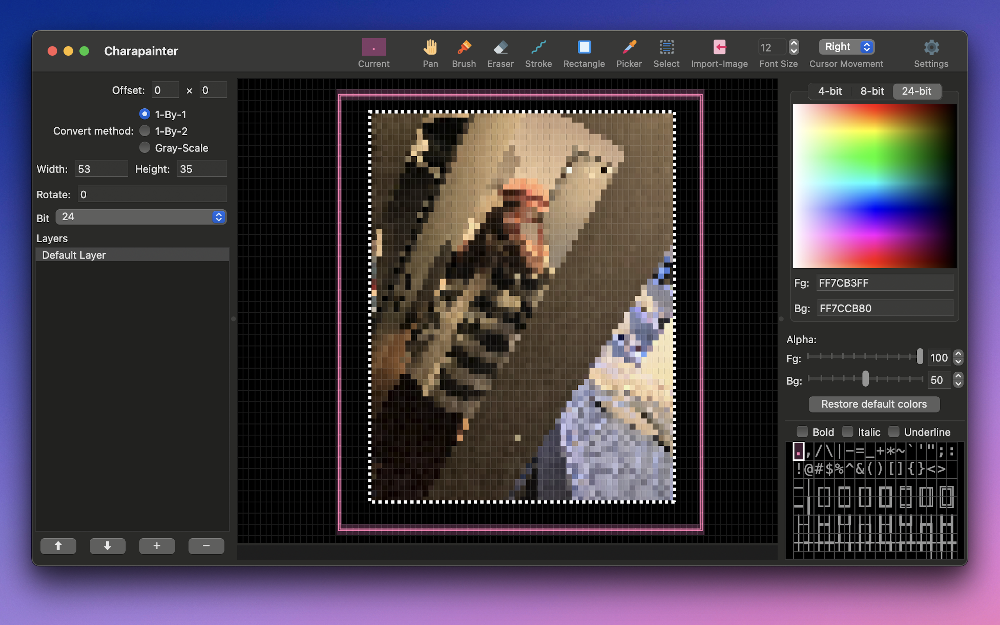

# Charapainter

[3.99$ currently on the AppStore](https://apps.apple.com/nl/app/charapainter/id6739626259?l=en-GB&mt=12)

You can build & use it your own if you can. There are also debug buid in Release, but they may not signed.

Dependencies:

- LispWorks (implementation)
- alexandria
- anaphora
- serapeum

Load the `charapainter` system, evaluate `(capi:contain (make-instance 'charapainter::main-interface))` to show the main interface.

## Promotion text

Drawing & converting images with colorful characters. Export to image, HTML and terminal

## Description

Charapainter is an application for creating colorful art using characters.

We support:

- Full editing features: shapes, lines, arrows, selection;
- Multiple layers, transparency and alpha blending, for both foreground and background
- Terminal-compliant 4-bit, 8-bit and 24-bit colors, for both foreground and background
- Bold, Italic and Underlined font styles
- Unicode dual-width characters (partial Emoji support)
- Export/Copy the artwork to HTML, ANSI escaped sequences, plain text, and images (PNG, JPEG, BMP, TIFF)
- Convert existing images into character art, in many creative styles

The application is focus and tidy, no useless features, no cloud, no AI, no internet connection needed. One-time purchase, lifetime support.

Contact the developer anytime if you want more features! :D

# Previews

